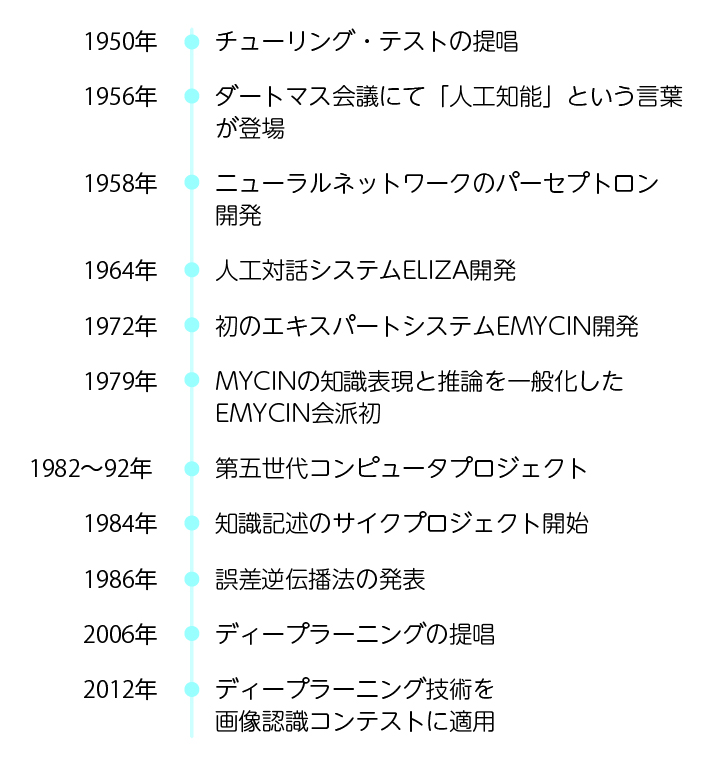
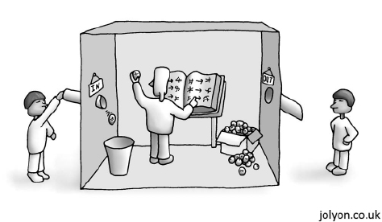
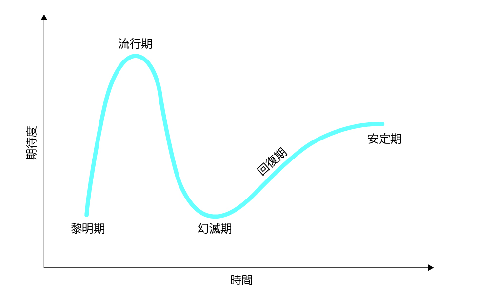
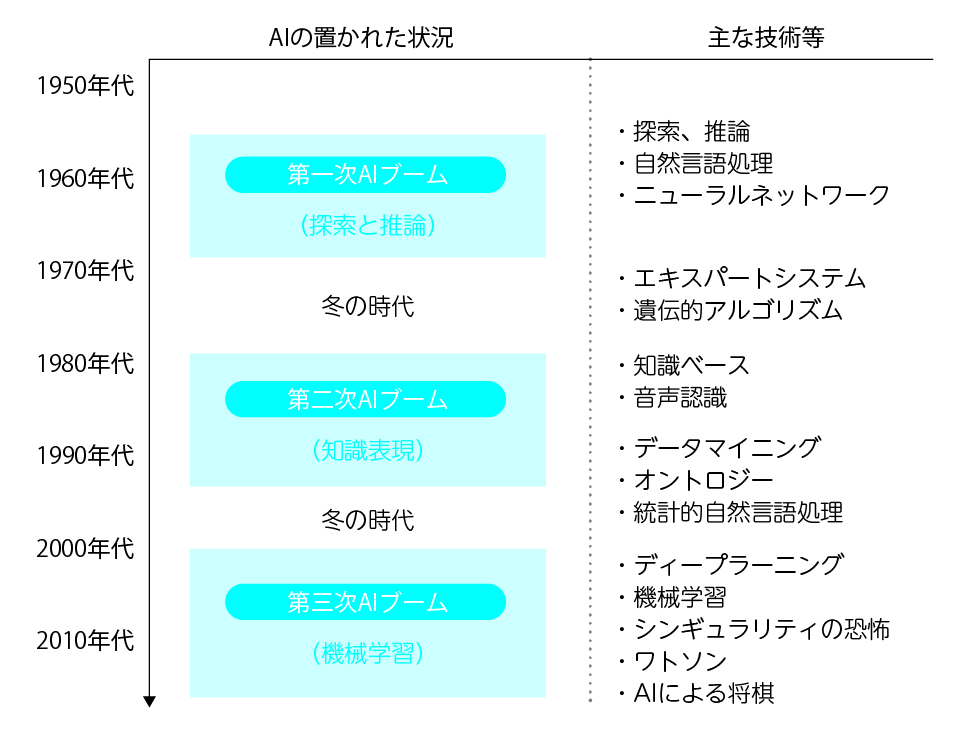
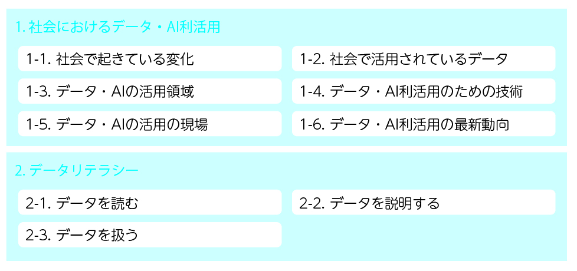

# 第1講 AIリテラシーとは

# 1-1 AIの定義
- AIとは

  

- 強いAIと弱いAI
  - 強いAI  
  ヒトの知能に迫るAI  
    (例) ドラえもん、鉄腕アトムなど
  - 弱いAI  
  限定的な問題解決や推論  
  (例) チェスや将棋のAI、画像認識など
- 人工知能の用途(弱いAI)
  - 画像認識  
  → 物体認識、画像生成
  - 音声、会話  
  → 音声認識、会話エンジン
  - 文章の認識、文章の作成  
  → チャットロボット、小説の執筆
  - 機械制御  
  → 自動運転、産業用ロボット
  - 作曲、絵画などのアート  
  → 自動作曲、画風の模倣
  - [DeepL翻訳](https://www.deepl.com/ja/translator)  
  → DeepL社が提供する機械学習を利用した翻訳サービス
    - Opportunities don't often come along. So, when they do,you have to grab them. - Audrey Hepburn -  
    (DeepL) チャンスは滅多に巡ってこない。だから、チャンスが来たらつかまなければならない。- オードリー・ヘプバーン  
    (ChatGPT) チャンスはそう頻繁に訪れるものではありません。だから、訪れたときにはつかむべきです。  - オードリー・ヘプバーン -
  - **代表的なAI画像生成ツール**
    - **DALL·E (OpenAI)**  
   テキストから高品質な画像を生成可能。  
   [実行例](https://chatgpt.com/share/677f1cc1-1b84-8002-a92b-6c2a8ab3cf1d)
    - **Stable Diffusion**  
   オープンソースでカスタマイズが容易。
    - **MidJourney**  
   特にアートに特化した高品質な画像生成。
    - **DeepArt**  
   写真を芸術的なスタイルに変換。
- 生成AI
  - ChatGPT  
  OpenAIが開発したAIアシスタント。ーザーの質問に答えたり、情報を提供したり、文章作成や問題解決のサポートをしたりするために設計されている。  
  [実行例1 テトリスの仕様](https://chatgpt.com/share/677e0423-d408-8002-9038-42035c429ac0)  
  [実行例2 テトリスの実装](https://chatgpt.com/share/67807a13-bb30-8002-9096-87b5bb97f76f)  
  [テトリス(実行)](https://kimiyukiyamauchi.github.io/tetris.js/)  
  [テトリス(ソース)](https://github.com/KimiyukiYamauchi/tetris.js)  
- 人間らしさとAI(チューニングテスト)
- 中国語の部屋

  

- チャットボット
- ELIZA効果
  - ものに愛着を感じてしまう
  - ペットロボット、Google Home、Amazon Echo
  - [Googleの対話型人工知能「LaMDA」は、本当に意識や感情を持ったのか？](https://note.com/it_navi/n/nbbe6a38f6fd7)
# 1-2 なぜAIが必要とされているのか
- AIへの期待
- ハイプ曲線

  

- AIブーム

  

# 1-3 この本ではどこまで学ぶのか
- AIのしくみや原理

  

- AIの発展と人間の自由