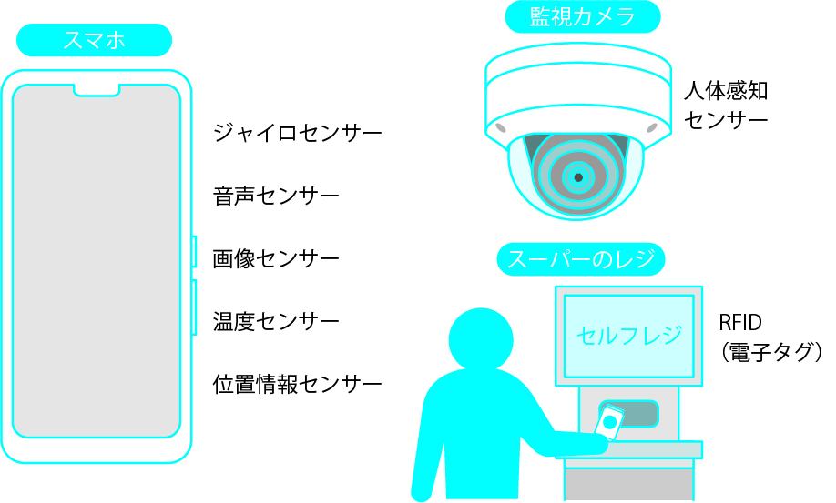

# 第2講 社会でどのような変化が起きているか

# 2-1 ビッグデータ、IoT、5Gなどの登場
- ビッグデータとは
- ビッグデータの定義

  

  

- オープンデータの活用
- IoTとビッグデータ
- 5GはIoTを促進

  

# 2-2 第4次産業革命、Society5.0
- 進化するテクノロジーと社会
- 第4次産業革命のテクノロジー

  

- 新しい社会Society5.0

  

  

# 2-3 データ駆動型社会
- データ革命による他分野への応用

  

- データ駆動型社会とは
  - ウエアラブルコンピュータの例：GoogleGlass

  

- データの扱い方が重要