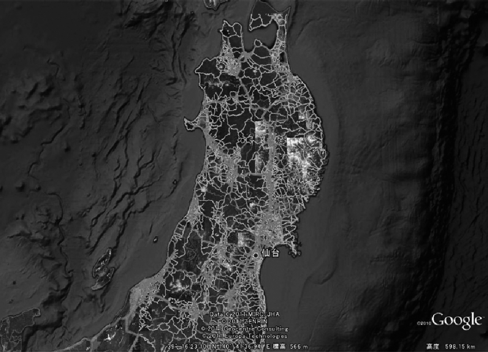
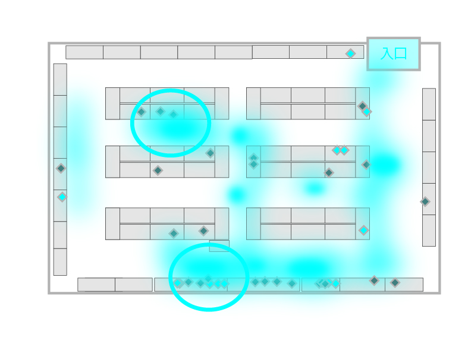
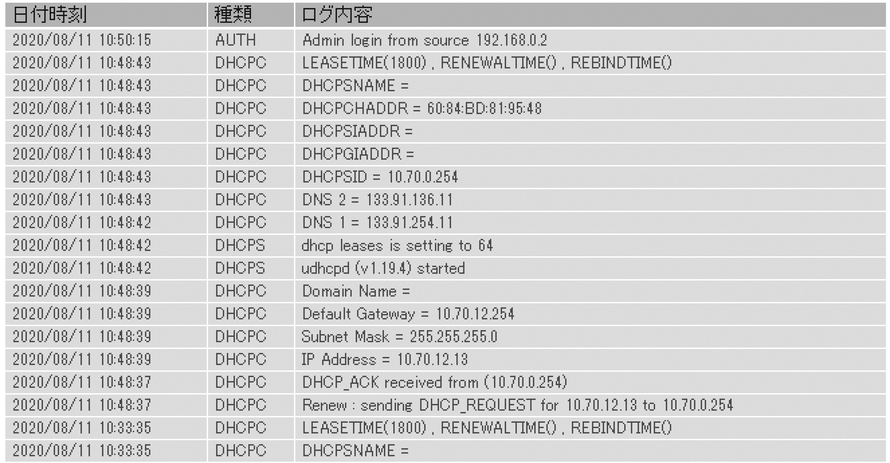
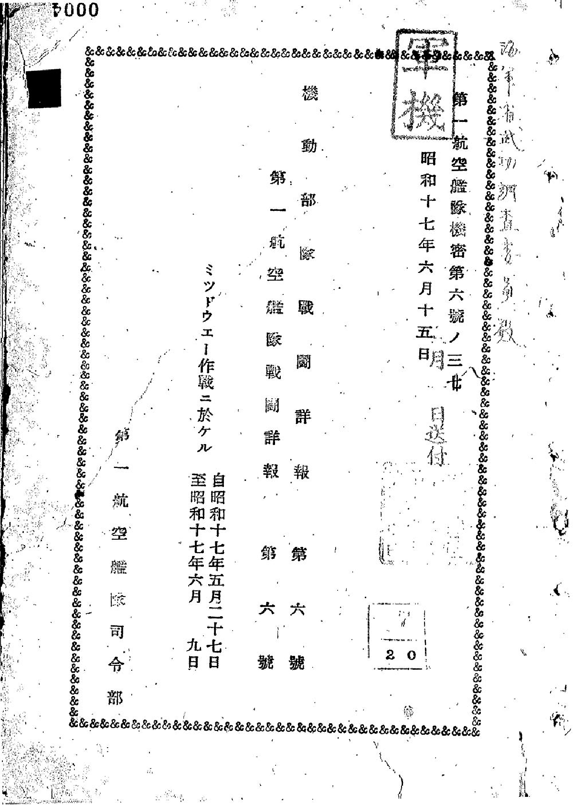
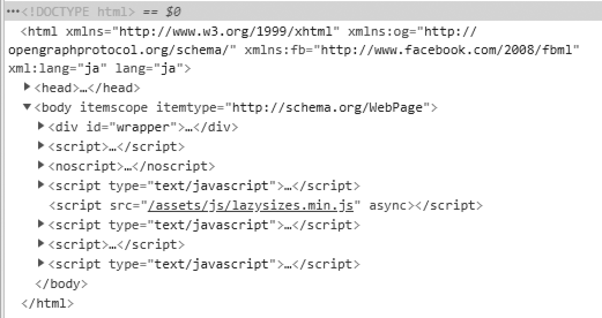

# 第3講 社会でどのようなデータが活用されているか

# 3-1 人の動線をめぐるデータ
- 注目される私的データ
  - 特に注目されているのは、人の行動のデータ
- カーナビの例
  - Hondaのカーナビゲーションシステム「インターナビ」による「交通実績情報マップ」  
  - カーナビ → 総合情報システム → 災害時のロジスティックス

  

- 監視カメラの例
  - 動線ヒートマップの例。色の強弱でデータを可視化
  - お客さんが店内をどう回遊しているのか、何に目を留め、どこに長い時間留まり、どんなものだとスルーしてしまうのかの分析に利用
  - 商品の販売促進、企業の競争戦略

  

# 3-2 多くの機器のログとオープンデータ
- SNSのデータ分析
  - データで分析することで、新しいビジネスやサービスなどの価値を生み出して、国や企業の競争力を上げていける
- オープンデータの活用
  - 自社だけでなく、他の企業や個人、行政機関にもデータを使ってもらう
  - CSVなどの形式で公開
  - サイバーカスケード
- ログによるアクセスデータ
  - 家庭用ルータのログ
    - ログから犯人を割り出す
    - NTP(Network Time Protocol)

  

# 3-3 1次データ、2次データ、メタデータ
- 1次データと2次データ
  - 1次データ  
  事象や出来事の情報を直接記録したもの
  - 2次データ  
  1次データをまとめて見やすくしたり、何かの目的のために1次データを取捨選択して説明を行ったりしたもの
  - 1次データだから素晴らしいと判断することには慎重になるべき
  

  

- メタデータ
  - データを説明するためのデータ
  - HTML

  

# 3-4 非構造化データの増大
- データベースとデータの構造化
  - リレーショナルデータベース
  - データを整える -> 構造化
- 非構造化データの活用
  - 小説などの文章、動画、静止画、音声