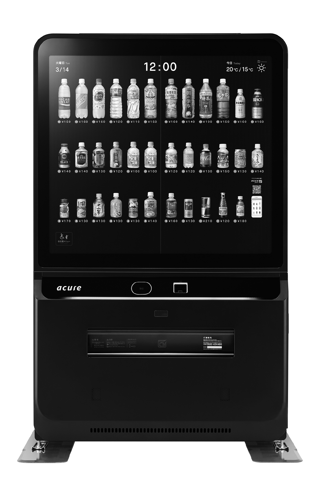
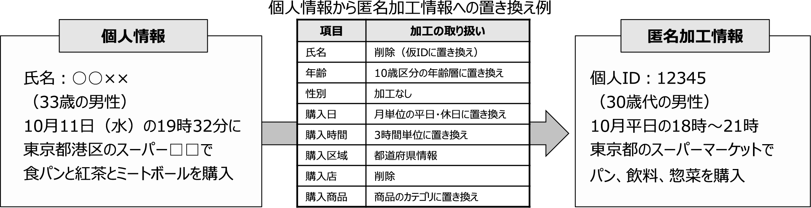
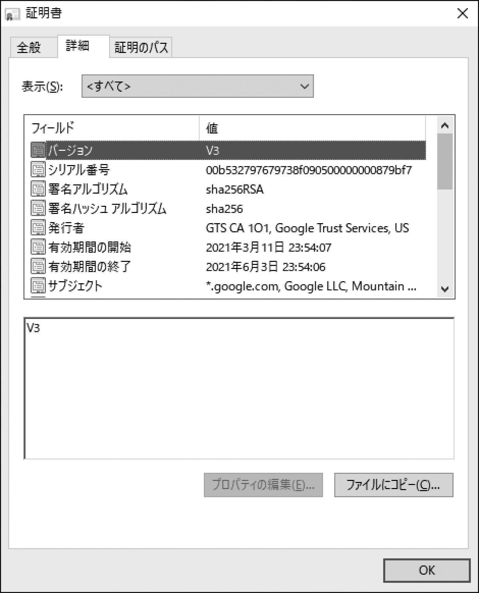
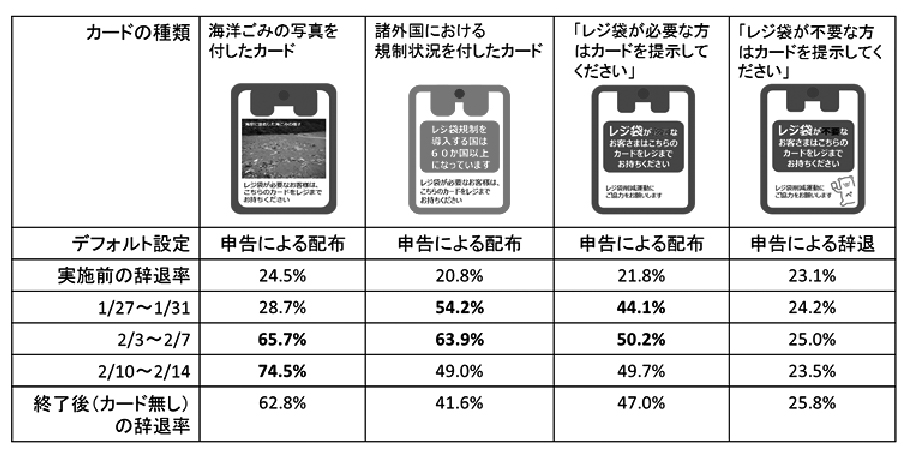

# 第4講 データ・AIを何に使えるか

# 4-1 データ・AIの活用領域の広がり
- 身近になっていくデータサイエンス
  - オープンデータ
- 多様化するデータの活用例
  - デジタルサイネージ(電子公告)  
  スマホと連動して利用者の情報を読み取り、その年代や嗜好にあわせた内容の広告を映し出す実験
  

    
  

  - 高度化された自動販売機  
  その日の気温や湿度から何がどのくらい売れるかの**需要予測**  
  利用者が目の前に立ったときにはセンサーからの情報で性別や年齢を判断し、その人にあった商品をすすめる
  - ワントゥワンマーケティング
  

    
    
  

- 日本でのデータ利活用
  - 個人情報  
  生存する個人の情報で、氏名や生年月日、ID、行動記録などによってこの人の情報だとわかってしまうもの
  - 個人情報保護法  
    - 個人データ  
    データベースなどによって体系化され使いやすくした個人情報
    - 要配慮個人情報  
    人種、信条、社会的身分、病歴、犯罪の経歴
- 匿名加工情報  
特定の個人を識別できないように個人情報を加工。「匿名加工情報」であれば、本人の同意がなくても第三者に提供できる  
-> 個人情報保護法の改定

    

# 4-2 具体的にどう使えばいいのか
- データの使い方・仮説検証型  
あらかじめ仮説を立て、その仮説に沿ってデータを収集。集められてデータを使って、この仮説は正しかった、間違っていたなどと検証

    

- データの使い方・仮説探索型  
仮説はないが集められるだけデータを集めて、取り敢えず分析を初めて見る
- 人の負担を軽減するエスカレーション
  - AIを使ったヘルプデスク
  - エスカレーション  
  最初はAIやバイトの人など、コストの低い形で受け付け、そこで問題が解決できてしまえばそれでOKで、もしダメなら、もっと上位の(でもお金がかかる)担当者に処理を引き継ぐ
- AIが得意な仕事、苦手な仕事
  - 「コミュニケーションを伴う単純作業」
  - 「AIに仕事を奪われる」 -> 「残された仕事」
  - メカニカルターク(Amazon Mechanical Turk)  
  WebインターフェースやAPIを通じて、世界中の人にさまざまな仕事を依頼する  
  -> 人間が情報システムの下請け
- 意思決定支援システム  
複雑な事象、瞬間的な判断を要求される業務には、AIをはじめとする情報システムの支援が必須
  - 株の高頻度取引(HFT:High Frequency Trading)  
事実上AIに売り買いの判断を任せている
  - [ロボアドバイザー](https://kakaku.com/robot-advisor/)
- AIの意外な使い方
  - AIに恐怖はなく、「もうこりごりだから、戦争はやめよう」とも言い出しません。

# 4-3 シェアリングエコノミー、エビテンスベース社会、ナッジ

    

- シェアリングエコノミーとは
  - 個人が持つ何らかの遊休資産を貸し出すサービス
  - 部屋や車、スキルなども含めて考える
- データとAIの活用で上手にマッチング
  - 供給側と受給側のマッチング
    - 魚や肉 => 市場規模が大きい => 市場や小売店舗などの仕組みが昔から構築されている
    - 車や自転車、配達という労働力の貸出しなど => 市場規模が小さい、遠隔地
      - 遠隔地もカバーする安価な通信手段
      - データの蓄積、それを分析するAI
      - AIがサポートしてマッチング

    

- ネットの信頼性とリスク
  - デジタル証明書
  - 評価爆撃
  - レビューシステム
  - 信用スコア
- エビデンスベース社会とは
  - エビデンス(証拠)ベース社会
  - エビデンス => ナッジ

  

    

